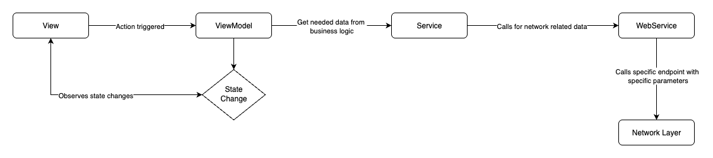

# Wiki-Places + Wikipedia

Inside this repository, there are 2 apps :

1. Wikipedia → A clone of the https://github.com/wikimedia/wikipedia-ios with additional changes to
   allow deeplink routing to places screen with given location coordinates.
     

2. Wiki-Places → Application which shows fetched locations from 2 sources, 1 being Wikipedia API,
   allows user interaction with the locations or searching a new location, and being able to deep
   link and discover in more detail the place into the Wikipedia application.

### App Architecture, SwiftUI, and MVVM architecture using Xcode 26.5

### The Wiki-Places, details worth mentioning.

- Build settings:
    - Swift 6
    - SWIFT_APPROACHABLE_CONCURRENCY → NO
    - SWIFT_DEFAULT_ACTOR_ISOLATION → nonisolated
    - SWIFT_STRICT_CONCURRENCY → Complete
        
- Minimum iOS version 17, to be able to use the @Observable macro
- No third-party libraries have been used, only native Apple embedded libraries.
- The entire Network layer is implemented using Apple's URLSession.
- Dependency injection through the constructor, and using our own protocol-oriented **Factory** pattern with
  NO static dependencies in memory.
- Unitests coverage ~30%, to showcase testability of the app using **Swift Testing**, full code
  coverage is still possible as the entire app is build to be mockable, except views which should be
  UITested.
- Assertions and debug/trace logging in some places, using OSLog.
- Swift concurrency using async/await, concurrent threads, and MainActor.

### Wiki-Places app UX flow:

- Upon opening the app, the user sees the map
- The user is able to pan around the map and select a point
- On map point selection, a marker appears, and at the bottom of the screen, a new button "Discover in
  Wikipedia" appears.
- There is a search area at the bottom of the screen, and when tapped the user is sent to the Places
  list screen.
    
- The second screen "Places list screen", first downloads the locations from the API provided in
  The assignment, there are 3- 4 locations being displayed initially, in the meantime a shimmer
  effect is being shown, until the metadata is being downloaded
- At the same time, the user is asked to type the place he/she is searching for.
- Searching text is debounced by 1 second.
- When the user finishes typing, a new request is executed to the Wikipedia official API, and
  Places are being returned based on the search term used.
- Images are downloaded separately using AsyncImage for each place, and if it fails a placeholder is
  used instead, spinner while downloading.
- If, while fetching new data, there are network issues, the user is notified by a popup.
- When a new place is selected from the "Places list screen", the location is being shown in the
  first screen on the map, with the ability to discover more in the Wikipedia app.
    
- When "Discover in Wikipedia" button is tapped, using a deep link, the user is sent to the
  Wikipedia-App if is installed, to screen "Places" with the selected Place displayed on the map.

NOTE: I have tested on simulators iPhone 17 and 17 Pro of iOS 26.1, 26.2, 26.4.1, 26.5, 18.6, and no
issues, only on iOS 26.0, selecting on the map is not being called.

### Wiki-Places app architecture components explained:

- **View** → **PlaceView**, **PlacesListView** the place where the UI is being created and action
  triggers/bindings to the viewModel.
    
- **ViewModel** → **PlaceViewModel**, **PlacesListViewModel** is the manager and the glue
  between views and business logic, the viewModel uses services to obtain or send data, and prepares
  it for the view to be displayed.
    
- **Service** →
    - **PlacesService** is the service responsible for the business logic, like, getting the
      locations and places, handling the errors that are needed for display, mapping between data
      transfer objects and models
    - **DeepLinkUrlComposer** is the service responsible for making deeplink URLs, based on data,
      Places deeplink contains, latitude, longitude and spanDistance.
        
- **WebService** → **PlacesWebService** is the service responsible for calling the exact API and
  endpoint needed with the parameters, it can be used to call other middleWare services to get
  new access tokens, or refresh the tokens if expired, as well as decoding strategies.
    
- **NetworkLayer** → is a composed layer using multiple components and services:
    - **RequestHandler** → Service manager using all the rest of the network layer component to
      perform a request, map the errors, decode, log, etc.
    - **RequestHandlerDelegate** → Service used for doing the challenges from the server and to do
      manual SSL pinning, in case is needed, by custom intermediate certificate public hash pinning.
    - The rest of the services are pretty simple and standard service to help with the request
      composing, parameterEncoding, errorHandling...
        

### MainThread is being used in the view and viewModel at this moment and the rest of the services called async are on the background threads, even if for now, there are no heavyweight computations.

## Wikipedia app changes

- Updated the deeplink functionality/parsing around the "Places" handling.
- Kept parts in objc and swift.
- Modified the "zoomAndPan" function inside "PlacesViewController" to accomodate for the
  spanDistance,
  as places coming from Wikipedia API had custom spanDistances.
- Through the Deeplink I send **lat**, **long** and **spanDistance**, which is being parsed in
  Wikipedia app, in objc, and passed to the activity in the userInfo.
- "placesViewController.view.layoutIfNeeded()" was needed to be called, because the mapView is not
  initialized if the user didn't yet open the "Places" tab, or the app is closed.

### Improvements, TODOs, limitations due to time constraints:

1. More accesbility, support for voice over, localization for multiple languages (*SwiftGen tool
   can be used).
     
2. Request retry rules, in certain cases, e.g up to 3 retries before considering a failure, for some
   of the requests, like downloading an image.
     
3. Caching of the most downloaded images on disk, if scrolling went too far, using something similar
   to CachedAsyncImage.
     
4. Infinite scrolling and paging while searching for places.
     
5. Improve UI scrolling performance by downloading specific sized images for the iphone sized and
   list size constraints.
     
6. UI Testing and snapshot testing.
     
7. More security around the API Keys (* although in the current app there was no API key needed),
   but keys can be stored in memory encoded in binary format, and upon using it, to be decoded.
     
8. For handling navigation with multiple screens, the coordinator pattern can be used.
     

### Thank you for the assignment.

Please let me know if there are any other questions, or if during testing, any issues are found.
  
Disclaimer: No AI was used to generate any code or README documentation, as this assignment was
used to test my capabilities.
